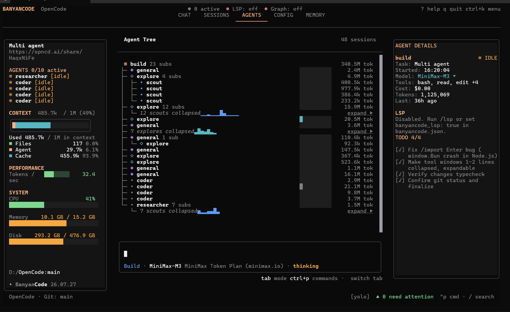
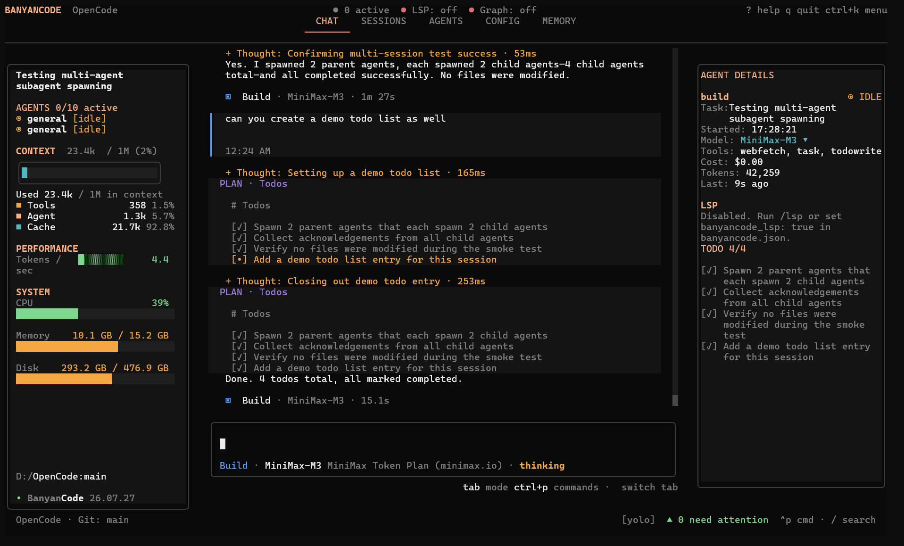

<div align="center">

# BanyanCode

**The agent harness for loop engineering.**

Turn one prompt into a coordinated coding system — parallel agents, persistent memory, codebase intelligence, and verification-ready workflows, all in a fast terminal UI.

[](https://www.npmjs.com/package/banyancode)
[](https://github.com/EkagraAgarwal/BanyanCode/releases/latest)
[](https://github.com/EkagraAgarwal/BanyanCode/blob/main/LICENSE)

</div>

---

## Installation

```bash
# YOLO
curl -fsSL https://raw.githubusercontent.com/EkagraAgarwal/BanyanCode/main/install | bash

# Windows
irm https://raw.githubusercontent.com/EkagraAgarwal/BanyanCode/main/install.ps1 | iex

# Package managers
npm i -g banyancode@latest          # or bun/pnpm/yarn
bun add -g banyancode                # Bun (fastest)
```

Run `banyancode` from any project directory — it opens in the current workspace and starts building an incremental code graph as you work.

---

## Why BanyanCode

Most coding agents give you a conversation. BanyanCode gives you a **system**.

- One prompt can launch a coordinated team of agents.
- Every agent gets the context and tools it needs, automatically.
- Your repository becomes searchable structure, not a pile of files.
- Memory compounds across sessions instead of vanishing with the chat.
- Verification is built into the loop, not bolted on afterward.

Use it for refactors, migrations, debugging, codebase onboarding, research-heavy implementation, and autonomous software engineering.

---

## Core Features

### Parallel Subagent Mesh
Dispatch `scout`, `coder`, and `researcher` agents concurrently from a single prompt. A primary orchestrator decomposes the task and fans work out across the mesh, governed by a configurable concurrency cap and an oldest-ended eviction policy — so nothing runs away with your resources.

<p align="center">
  
  <br />
  <sub>The Agent Tree view — full visibility into every subagent, nested subagent, and its token spend.</sub>
</p>

### Loop Engineering
Build repeatable agent loops with goals, actions, verification, retries, and memory — instead of manually driving every turn yourself. The core workflow is always:

```text
trigger → context → plan → execute → verify → remember → repeat
```

<p align="center">
  
  <br />
  <sub>Live plans, todo tracking, and system stats — right inside the chat.</sub>
</p>

### Persistent Cross-Session Memory
A multi-tiered memory engine that actually remembers your codebase between sessions: candidate extraction, intent classification, hybrid FTS5/tag retrieval, and automated hygiene sweeps (expire → reconcile → prune) keep memory useful instead of stale.

### Codebase Intelligence (Tree-Sitter Code Graph)
`/codegraph-build` indexes your repository into a live, queryable graph of symbols, callers, dependents, tests, impact, and ownership — powered by Tree-Sitter parsing with regex fallbacks for anything it doesn't natively understand.

### Verification Hooks
Repository context, blast-radius analysis, preflight checks, tests, and review loops keep every agent change grounded in reality before it lands.

### Free Research Loop
A `researcher` subagent backed by DuckDuckGo HTML search — no API key required, no rate-limit bill.

### Terminal-Native UX
A fast TUI with a command palette, built-in LSP support, model switching, execution traces, and full keyboard control.

---

## The Workflow

```text
Prompt
  └─► Orchestrator
       ├─► Scout       explores the repository
       ├─► Coder       implements the change
       ├─► Researcher  checks external knowledge
       ├─► Memory      carries context across sessions
       └─► Code graph  verifies structure and impact
                    └─► merged, reviewable result
```

---

## Commands

Type `/` in the TUI to browse every command. The core workflow includes:

| Command | Purpose |
|---|---|
| `/init` | Set up `AGENTS.md` for the workspace. |
| `/review` | Review uncommitted changes, commits, branches, or pull requests. |
| `/codegraph-build` | Build or refresh the tree-sitter code graph. |
| `/repository-query` | Search symbols, tests, docs, configs, and relationships together. |
| `/repository-explain` | Understand a symbol through an architectural slice. |
| `/repository-trace` | Trace downstream dependents through the graph. |
| `/repository-impact` | See the blast radius of a change. |
| `/repository-tests` | Find tests connected to a symbol. |
| `/websearch-free` | Search the web with the researcher agent. |
| `/max-subagents` | Set the concurrency ceiling for the mesh. |
| `/lsp` | Toggle built-in language servers. |
| `/yolo` | Enable automatic permission approval for sandboxed workflows. |

---

## Configuration

BanyanCode is its own product and uses `banyancode.json` — never `opencode.json`.

```json
{
  "banyancode_lsp": true,
  "banyancode_max_subagents": 10,
  "agent": {
    "coder": { "model": "minimax-coding-plan/MiniMax-M3" },
    "scout": { "model": "minimax-coding-plan/MiniMax-M3" },
    "researcher": { "model": "minimax-coding-plan/MiniMax-M3" }
  }
}
```

| Key | Default | Purpose |
|---|---:|---|
| `banyancode_lsp` | `false` | Enable built-in language servers. |
| `banyancode_max_subagents` | `5` | Cap concurrent subagents from 1 to 20. |
| `banyancode_yolo_mode` | `false` | Automatically approve permissions. |
| `banyancode_disable_websearch` | `false` | Disable the free researcher agent. |
| `banyancode_codegraph_watch_enabled` | `true` | Update the code graph as files change. |

---

## Data & Privacy

Project data stays local by default:

```text
.banyancode/
├── banyancode.db
├── ignore
└── trace/
```

BanyanCode never reads or writes OpenCode configuration or data. Global BanyanCode data lives under `~/.config/banyancode/` and `~/.local/share/banyancode/`.

---

## Development

BanyanCode uses Bun and a monorepo workspace.

```bash
bun install
bun run lint
bun typecheck
```

Run package tests from the package directory, not the repository root:

```bash
cd packages/core
bun test
```

---

## Built On

- [OpenCode](https://github.com/anomalyco/opencode) — the TUI / CLI runtime BanyanCode forks from
- [Effect](https://effect.website) — type-safe service architecture
- [tree-sitter](https://tree-sitter.github.io) — incremental parsing
- [DuckDuckGo HTML](https://duckduckgo.com/html/) — free web search
- [libSQL](https://turso.tech) — embedded SQL storage

## License

[MIT](./LICENSE)
