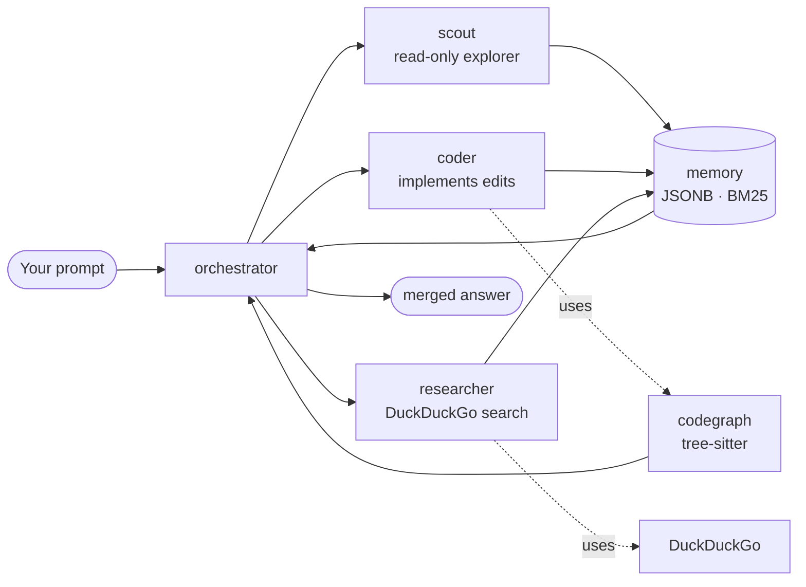

<div align="center">

# BanyanCode

**Orchestrate parallel coding agents with a persistent memory layer and a tree-sitter code graph.**

<a href="https://www.npmjs.com/package/banyancode"></a>
<a href="https://github.com/EkagraAgarwal/BanyanCode/releases/latest"></a>
<a href="https://github.com/EkagraAgarwal/BanyanCode/blob/main/LICENSE"></a>
<a href="https://nodejs.org"></a>
<a href="https://effect.website"></a>

</div>

A single tool that replaces manual multi-agent orchestration, ad-hoc memory, grep-as-graph, and ChatGPT-for-research — built on top of [OpenCode](https://github.com/anomalyco/opencode), in your terminal.



*Four concurrent subagents, three data sources, one final answer.*

---

## Highlights

A single tool to replace manual multi-agent orchestration, ad-hoc session memory, grep-as-graph, and ChatGPT-for-research.

- **Orchestrator + subagent mesh** — dispatch up to 20 subagents concurrently from one prompt, with hard runtime caps and peer-to-peer message routing.
- **Cross-session memory** — every useful fact a subagent learns gets persisted as versioned JSONB in a local libSQL database; recall across sessions is BM25 + structural.
- **Tree-sitter code graph** — TypeScript, Python, Go, Rust, and 7 more languages indexed once; query by symbol, file, or pattern in milliseconds.
- **Repository intelligence** — 8 public methods (`query`, `explain`, `impact`, `trace`, `tests`, `symbols`, `relationships`, `ownership`) returning a typed `ArchitecturalSlice`.
- **Free web search** — DuckDuckGo-backed `researcher` subagent requires no API key and runs on every platform.
- **TUI command palette** — `/init`, `/review`, `/codegraph-build`, `/repository-*`, `/yolo`, `/max-subagents`, `/lsp`, `/refresh-models`, `/websearch-free`.

---

## Install

### macOS / Linux / WSL

```bash
curl -fsSL https://raw.githubusercontent.com/EkagraAgarwal/BanyanCode/main/install | bash
```

### Windows (PowerShell)

```powershell
irm https://raw.githubusercontent.com/EkagraAgarwal/BanyanCode/main/install.ps1 | iex
```

### npm (any platform with Node 20+)

```bash
npm i -g banyancode
```

*The installer detects your CPU and falls back to `windows-x64-baseline` if AVX2 is unsupported. Run `banyancode --version` to confirm.*

Then drop into any workspace:

```bash
cd your-project/
banyancode
```

The TUI starts in the current directory; the code graph builds on first launch and indexes the workspace incrementally from there.

---

## What you get

### A parallel subagent mesh

```
 ╭────────────── BanyanCode · orchestrator ──────────────╮
 │                                                       │
 │  Plan: refactor codegraph-indexer.ts into 3 modules   │
 │                                                       │
 │  Subagents: 4 active · 2 done · 1 queued              │
 │  Memory entries read: 17 (3 cross-session)            │
 │                                                       │
 ╰───────────────────────────────────────────────────────╯
```

`scout`, `coder`, and `researcher` run in parallel. Each one is its own Effect service with its own permission set, model, and tool registry. The orchestrator coordinates the join.

### Persistent cross-session memory

Every tool call that produces a "remember this" annotation gets persisted. Next session, the same memory entries surface as `references: 3` in the system prompt — no LLM-side context stuffing.

```
- [x] **Orchestrator** — dispatch parallel subagents from one prompt
- [x] **Memory** — JSONB-backed cross-session recall with versioning
- [x] **Code graph** — tree-sitter indexed symbols + callers + impact
- [x] **Researcher** — DuckDuckGo-backed free web search, no API key
- [x] **TUI command palette** — slash commands for every tool
- [x] **Repository intelligence** — 8 typed methods, `ArchitecturalSlice` output
- [x] **YOLO mode** — auto-approve all permissions for sandboxed workflows
- [x] **LSP toggle** — `/lsp` enables built-in language servers per session
```

### Tree-sitter code graph

```
├─ packages/
│  ├─ core/src/
│  │  ├─ banyancode/
│  │  │  ├─ codegraph-repo.ts          (12,349 LOC, 47 symbols)
│  │  │  ├─ codegraph-indexer.ts       ( 8,201 LOC, 31 symbols)
│  │  │  ├─ codegraph-build-service.ts ( 2,140 LOC,  9 symbols)
│  │  │  ├─ memory-repo.ts             ( 6,500 LOC, 22 symbols)
│  │  │  └─ repository-intelligence/
│  │  │     ├─ service.ts              ( 4,800 LOC, 18 symbols)
│  │  │     └─ bfs.ts                  (   220 LOC,  3 symbols)
│  │  └─ v1/config/banyan-config.ts    (   120 LOC,  2 symbols)
│  └─ opencode/src/
│     ├─ lsp/lsp.ts                    (   511 LOC, 14 symbols)
│     └─ command/index.ts              (   440 LOC, 22 symbols)
├─ .banyancode/                        (auto-created)
│  ├─ banyancode.db                    (codegraph + memory)
│  ├─ ignore                           (per-project exclude patterns)
│  └─ trace/<sessionID>.jsonl          (full tool-call trace)
└─ banyancode.json                     (project config)
```

Indexed incrementally by `@parcel/watcher` after the first build. New `.ts`/`.py`/`.go`/`.rs` files are added to the graph within ~250ms of being saved.

### Repository intelligence — 8 typed methods

```ts
type ArchitecturalSlice = {
  summary: string                  // 1-paragraph overview
  entrypoints: CodegraphNode[]     // public surface
  importantSymbols: CodegraphNode[]// high-degree nodes
  relatedTests: TestReference[]    // evidence-ranked (tested_by > calls > import)
  relatedDocs: DocReference[]      // adjacent markdown / docs
  configs: ConfigReference[]       // adjacent config files
  routes: HttpRoute[]              // adjacent HTTP handlers
  dependencies: DependencyEdge[]   // transitive dependents
}

// All 8 methods return ArchitecturalSlice:
// query, explain, impact, trace, tests, symbols, relationships, ownership
```

`impact("packages/core/src/banyancode/codegraph-indexer.ts")` returns every file that would need to change if you renamed `CodegraphRepo.Service`. The blast radius is computed via shared `bfsPure` over the code graph with per-direction edge-kind allowlists — no `Array.shift`, no per-node queries, 2 SQL queries per frontier instead of 2 per node.

### Free web search (no API key)

```bash
/websearch-free "react server components vs remix loaders"
```

The `researcher` subagent answers with a citation list. Useful when `coder` needs to confirm an API signature or `explore` needs a public example it can't find in the local repo.

---

## Architecture

```
            ┌─────────────────────────────────────────────────────┐
            │                      CLI / TUI                       │
            │   banyancode      banyancode codegraph build         │
            │   banyancode      banyancode repository query        │
            │   banyancode      banyancode websearch-free          │
            └────────────────────────────┬────────────────────────┘
                                         │ HTTP (Effect HttpApi)
            ┌────────────────────────────┴────────────────────────┐
            │              /global/* (RootHttpApi)                 │
            │   POST /global/codegraph-build                      │
            │   POST /global/codegraph-cancel                     │
            │   POST /global/codegraph-remove                     │
            │   POST /global/repository/query                     │
            │   GET  /global/banyan-config                        │
            │   PATCH /global/banyan-config                       │
            │   POST /global/websearch-free                       │
            └────────────────────────────┬────────────────────────┘
                                         │
            ┌────────────────────────────┴────────────────────────┐
            │               packages/core (Effect v4)             │
            │                                                     │
            │  ┌──────────────────┐    ┌────────────────────────┐ │
            │  │ CodegraphRepo    │    │ BanyanConfigService    │ │
            │  │ + Indexer        │    │ (banyancode.json)      │ │
            │  │ + BuildService   │    └────────────────────────┘ │
            │  │ + Search         │    ┌────────────────────────┐ │
            │  │ + RepositoryIntel│    │ MeshCoordinator        │ │
            │  └────────┬─────────┘    │ + SubagentBus          │ │
            │           │              │ + MaxSubagentsService  │ │
            │           ▼              └────────────────────────┘ │
            │   ┌──────────────────┐    ┌────────────────────────┐ │
            │   │ libSQL / SQLite  │    │ MemoryRepo             │ │
            │   │ banyancode.db    │    │ + BM25                 │ │
            │   └──────────────────┘    │ + JSONB versioning     │ │
            │                           └────────────────────────┘ │
            └─────────────────────────────────────────────────────┘
```

**BanyanCode is its own product identity.** It does not read `opencode.json`; all BanyanCode-specific settings live in `banyancode.json` (project root) or `~/.config/banyancode/banyancode.json` (global).

---

## Configuration

Minimal `banyancode.json`:

```json
{
  "banyancode_lsp": true,
  "banyancode_max_subagents": 10,
  "agent": {
    "coder":     { "model": "minimax-coding-plan/MiniMax-M3" },
    "explore":   { "model": "minimax-coding-plan/MiniMax-M3" },
    "researcher":{ "model": "minimax-coding-plan/MiniMax-M3" },
    "scout":     { "model": "minimax-coding-plan/MiniMax-M3" }
  }
}
```

| Key | Default | Effect |
|---|---|---|
| `banyancode_lsp` | `false` | Enable built-in LSP servers (typescript, gopls, pyright, rust-analyzer, …). Per-server overrides: `{"typescript": {"disabled": true}}` |
| `banyancode_max_subagents` | `5` | Hard runtime cap on concurrent subagents. Range 1–20. |
| `banyancode_yolo_mode` | `false` | Auto-approve all permissions including dangerous ones. **Bypass with care.** |
| `banyancode_disable_websearch` | `false` | Disable the free DuckDuckGo `researcher` subagent. |
| `banyancode_codegraph_watch_enabled` | `true` | Auto-update the code graph on file save (debounced). |
| `banyancode_codegraph_exclude_patterns` | `[]` | Glob patterns to exclude from indexing (in addition to `.banyancode/ignore`). |
| `banyancode_telegram_*` | unset | Telegram bot config (`bot_token`, `webhook_secret`, `default_session`). |
| `agent.<name>.model` | unset | Per-agent model override (`providerID/modelID`). |

Edit interactively with `/max-subagents`, `/yolo`, `/lsp`. Emits `banyancode.config.updated` to all subscribers on save.

---

## Slash commands

| Command | What it does |
|---|---|
| `/init` | Guided `AGENTS.md` setup for the workspace. |
| `/review` | Review uncommitted changes (or `[commit\|branch\|pr]`). |
| `/codegraph-build [path] [--force]` | Build the tree-sitter code graph for a workspace. |
| `/codegraph-remove` | Clear the index (or delete the DB with `--drop-file`). |
| `/repository-query <symbol-or-text>` | Unified semantic search across symbols, tests, docs, configs. |
| `/repository-explain <symbol>` | Architectural slice for one symbol (entrypoints, tests, docs). |
| `/repository-trace <symbol>` | Walk the code graph to downstream dependents. |
| `/repository-impact <file>` | Files that would change if you renamed a function in this file. |
| `/repository-tests <symbol>` | Tests that reference the symbol (evidence-ranked). |
| `/repository-symbols <prefix>` | All symbols matching a name prefix. |
| `/repository-relationships <node>` | Adjacent nodes in the code graph. |
| `/repository-ownership <file>` | Most active author for a file by git history. |
| `/websearch-free <query>` | DuckDuckGo HTML search, no API key. |
| `/yolo` | Toggle YOLO mode (auto-approve all). |
| `/max-subagents [N]` | Set or read the subagent concurrency cap. |
| `/lsp [on\|off\|toggle]` | Toggle BanyanCode's built-in LSP servers. |
| `/refresh-models` | Refresh the models catalog from models.dev. |

Type `/` in the prompt to see the full autocomplete list.

---

## HTTP / SDK surface

All endpoints live under `/global/*` on the running BanyanCode server:

```
POST   /global/codegraph-build         start a code graph build (root, force)
POST   /global/codegraph-cancel        interrupt a running build
POST   /global/codegraph-force-kill    force-kill a stuck build (Windows: taskkill fallback)
POST   /global/codegraph-remove        clear the index (dropFile unlinks the DB)
POST   /global/repository/query        unified repository context
POST   /global/repository/explain      architectural slice for a symbol
POST   /global/repository/trace        trace downstream dependents
POST   /global/repository/impact       blast radius for a file
POST   /global/repository/tests        tests for a symbol
POST   /global/repository/symbols      symbol lookup by prefix
POST   /global/repository/relationships   adjacent nodes
POST   /global/repository/ownership    most active author
POST   /global/websearch-free          DuckDuckGo HTML search
GET    /global/banyan-config           read banyancode.json
PATCH  /global/banyan-config           update banyancode.json
PATCH  /global/banyan-agent-override   atomic agent enabled/model update
PATCH  /global/banyan-agent-prompt     atomic per-agent prompt update
GET    /healthz                        liveness
```

The TypeScript SDK regenerates from this surface via `cd packages/sdk/js && bun script/build.ts`. TUI consumes it as `sdk.client.global.codegraph.remove({...})`.

---

## Data layout

```
~/.config/banyancode/
├── banyancode.json                    # global config (per-project overrides win)
├── agent/<name>.md                    # custom agent definitions
├── skills/                            # agent-defined skills
└── plans/                             # orchestrator plan snapshots

~/.local/share/banyancode/
├── banyancode.db                      # main libSQL: memory + codegraph
└── trace/<sessionID>.jsonl            # full tool-call trace (JSONL)

./.banyancode/                         # project-local (per-workspace)
├── banyancode.db                      # shared with global DB if no local
├── ignore                             # one pattern per line, gitignore syntax
└── trace/                             # per-session traces
```

Run `banyancode uninstall` to remove every install — curl binary, npm/pnpm/yarn/bun/brew/choco/scoop/snap copies, every data directory.

---

## Acknowledgements

BanyanCode stands on the shoulders of:

- [OpenCode](https://github.com/anomalyco/opencode) — the TUI / CLI runtime BanyanCode forks from
- [Effect](https://effect.website) — the v4 type-safe service architecture
- [tree-sitter](https://tree-sitter.github.io) — incremental parsing for the code graph
- [DuckDuckGo HTML](https://duckduckgo.com/html/) — free web search backend for the `researcher` subagent
- [libSQL / Turso](https://turso.tech) — embedded SQL with JSONB and BM25
- [@parcel/watcher](https://github.com/parcel-bundler/watcher) — filesystem events for incremental code graph updates

---

## License

[MIT](./LICENSE) — see `LICENSE` for the full text.