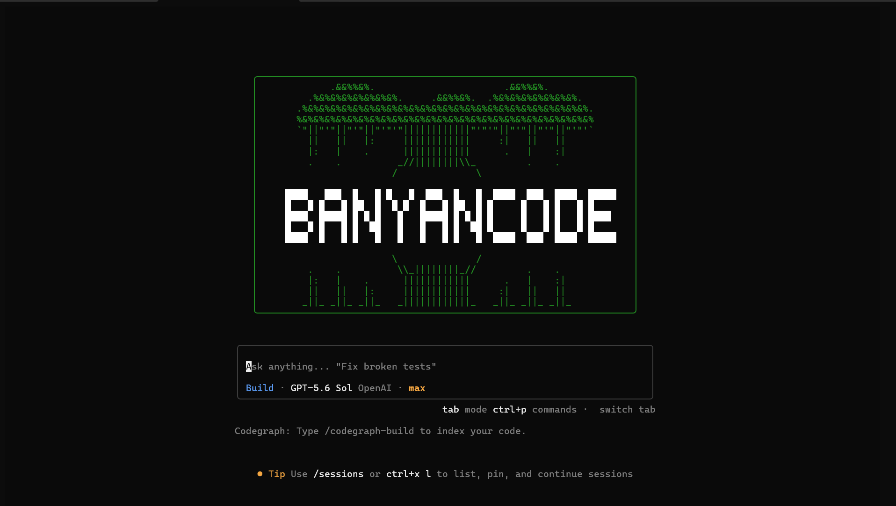
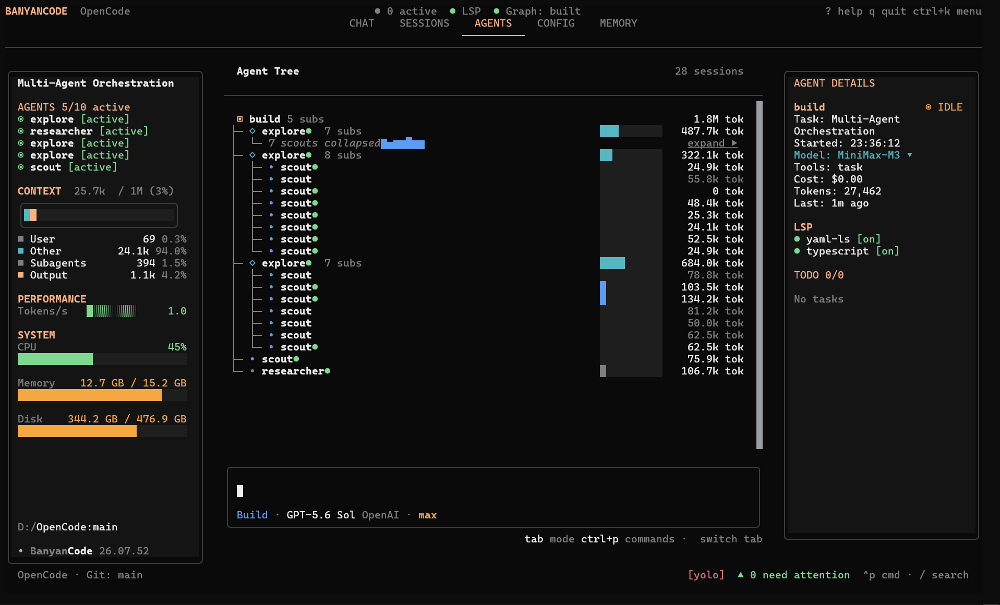
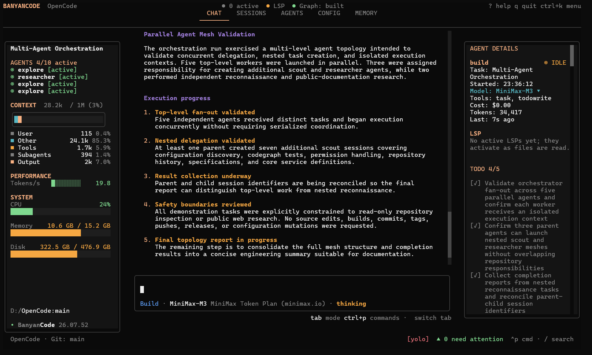

<div align="center">

# BanyanCode

### A coding agent with a team, a memory, and a map.
*It queries the code graph instead of reading through it.*

**Parallel subagents. Cross-session memory. Tree-sitter code graph. Free web research.**
One coordinated TUI for agentic coding — built on [OpenCode](https://github.com/anomalyco/opencode).

[](https://www.npmjs.com/package/banyancode)
[](https://github.com/EkagraAgarwal/BanyanCode/releases/latest)
[](https://github.com/EkagraAgarwal/BanyanCode/blob/main/LICENSE)
[](#installation)

</div>

---

<p align="center">
  
</p>

<p align="center">
  <sub>The <b>Homescreen</b> — open a session, pick a workspace, and start a coordinated team of agents.</sub>
</p>

---

## At a glance

- **Tools over tokens.** Agents query the code graph for callers, tests, and blast radius — they don't read 500 lines to guess at them.
- **A team, not a chat window.** An orchestrator fans work out to parallel specialist subagents and watches them work, live.
- **Memory that survives the session.** Decisions and conventions persist across chats and feed the next one automatically.
- **Research without leaving the terminal.** A free, keyless web researcher agent, cited and in-loop with the coding work.

---

## What is BanyanCode?

BanyanCode is an **open-source terminal coding agent** for serious software engineering. It's built on [OpenCode](https://github.com/anomalyco/opencode) and extends it with an **orchestrator-led subagent mesh**, a **cross-session memory engine**, a **Tree-sitter code graph**, and a **free web researcher** — all wired into one fast, keyboard-driven TUI.

You ask for a refactor, migration, debug, or research-heavy implementation. BanyanCode decomposes it, fans work out to **specialist subagents in parallel**, gives every agent the context it needs from the code graph and memory, watches them work in real time, **verifies** the result, and remembers what it learned for next time — treating a full-file read as a last resort, not a first instinct.

> **One prompt. A coordinated engineering team that knows what it's touching before it touches it.**

---

## Philosophy: tools over tokens

> If an agent has to read 500+ contiguous lines to understand a function, that isn't context. It's cost.

Reading whole files burns tokens and floods the context window — and it still doesn't answer the one question that matters before an edit ships: *what breaks?* `grep` finds text. It doesn't find structure. An agent that "read the file" can still ship a change that quietly breaks three callers in three other directories, because reading a function tells you nothing about who's calling it.

BanyanCode's rule is simple: **structural questions get structural tools, not eyeballs.** Before touching a symbol, agents run `preflight` or `blast_radius` for a decision-ready answer — callers, tests, docs, configs, risk — in a single query, instead of paging through files hoping to spot the dependency by hand. `read` still exists for the moments it's genuinely the right tool. It's just no longer the default.

---

## The Four Pillars

### 1. Parallel Subagent Mesh

The orchestrator decomposes your task and dispatches specialist agents — `scout`, `coder`, `explore`, `researcher`, `reviewer` — **concurrently**. They share state over a typed message bus, request help from each other, report progress, and surface results in a unified agent tree. A user-configurable cap with **oldest-ended eviction** keeps concurrency bounded so nothing runs away with your resources.

<p align="center">
  
</p>

<p align="center">
  <sub>The <b>AGENTS</b> tab — every subagent, every nested spawn, every token, live in one terminal.</sub>
</p>

### 2. Cross-Session Memory

Most agents forget between chats. BanyanCode has a **persistent memory engine**: structured JSONB payloads, versioned for non-destructive evolution, hybrid FTS5 + tag retrieval, automated hygiene (expire → reconcile → prune). Subagents emit **candidates**; the orchestrator **promotes** the durable ones. Your decisions, conventions, and hard-won lessons **survive the chat** and feed the next session automatically.

> **Stop re-explaining your project.**

### 3. Tree-Sitter Code Graph — know before you touch

`/codegraph-build` indexes your repository into a **queryable graph of symbols, callers, dependents, tests, configs, routes, and impact**. Every agent gets structural context, not just file names or grep hits. Before any edit, agents run `preflight`, `blast_radius`, `repository_trace`, and `repository_tests` to **know what breaks before they touch the code** — no 500-line read required.

<p align="center">
  
</p>

<p align="center">
  <sub>The <b>Chat</b> view — live plan, live todos, live tool calls, live synthesis.</sub>
</p>

> **See the system, not just the file.**

### 4. Free Web Researcher

When the answer isn't in the repo, a `researcher` subagent hits the web through **DuckDuckGo HTML** — **no API key, no rate-limit bill**. Findings return with citations your agents can act on, inside the same loop as the implementation work.

> **Research the web without leaving the terminal.**

---

## Why BanyanCode

| The problem with single-agent coding | What BanyanCode does instead |
|---|---|
| One model is a bottleneck on every task | **Fan work out to specialists** — explore, implement, research, review in parallel |
| Parallel sessions don't coordinate | **Orchestrator-led mesh** with typed peer messaging and live progress |
| Chats forget prior decisions | **Cross-session memory** with candidate promotion and durable recall |
| Full-file reads burn tokens and still miss the blast radius | **Structural tools** return exact callers, dependents, tests, and risk in one query |
| Research breaks the coding flow | **Built-in cited web researcher** that runs as a subagent |
| Parallel work becomes opaque | **Live TUI activity** with agent tree, status pills, and review hooks |

Use it for **refactors, migrations, debugging, codebase onboarding, research-heavy implementation, and autonomous software engineering** — anywhere one conversation isn't enough.

---

## The Toolbelt

Every subagent draws from the same toolbelt, organized by job — **30+ tools across 8 categories**, called only when the task actually needs them. Structural questions go to structural tools; `read` is there when nothing else fits.

<details>
<summary><b>Expand full tool reference</b></summary>

<br>

**Code Intelligence** — the code graph, queried instead of read

| Tool | Purpose |
|---|---|
| `codegraph_build` | Build or rebuild the tree-sitter code graph index for the workspace |
| `codegraph_remove` | Delete the code graph index (preserves `banyancode.db` by default) |
| `code_find` | Locate a symbol's definition, callers, dependents, impact, or file |
| `preflight` | Decision-ready report: callers, tests, docs, configs, event bridges, HTTP routes, risk |
| `blast_radius` | Count-only blast radius — direct/transitive callers, files, tests, risk verdict |
| `edit_plan` | Plan an edit before applying it, or verify blast radius after |
| `safe_rename` | Generate every call-site edit for a symbol rename, plus the tests to run |
| `repository_query` | Semantic search across symbols, files, tests, docs, configs, and git signals |
| `repository_explain` | Architectural slice for a symbol: entrypoints, dependencies, tests, docs |
| `repository_trace` | Follow imports/calls outward from a symbol, to a configurable depth |
| `repository_impact` | File- or feature-level impact: what breaks if this file changes |
| `repository_tests` | List the test files that reference a symbol |
| `banyan_repo_map` | Token-budgeted workspace outline — packages, entry points, per-file symbols |

**File & Code**

| Tool | Purpose |
|---|---|
| `read` | Read file or directory contents, with line numbers and offset/limit |
| `write` | Write or overwrite a file |
| `edit` | Exact string replacement (`oldString` → `newString`) |
| `glob` | Fast file pattern matching (e.g. `**/*.ts`) |
| `grep` | Regex content search across files |

**Execution & Testing**

| Tool | Purpose |
|---|---|
| `bash` | Run shell commands — git, npm, build, etc. |
| `banyan_test` | Run `bun test <path>` with parsed pass/fail/skip counts |
| `system_status` / `systeminfo` | CPU, memory, GPU, VRAM, and platform info |

**Memory & State**

| Tool | Purpose |
|---|---|
| `memory_store` / `recall` / `list` / `search` / `forget` | Persistent key-value memory, scoped globally or per session |
| `memory_candidate_emit` | Emit a pending memory candidate for promotion to durable memory |
| `shared_memory` | Cross-subagent key-value store with versioning |

**Subagent Mesh**

| Tool | Purpose |
|---|---|
| `task` | Launch background subagents — coder, explore, scout, researcher |
| `mesh_control` | Checkin, steer, kill, plan-for, or dispatch a reviewer subagent |
| `mesh_subscribe` | Live stream of peer subagent messages |
| `subagent_message` | Send request/inform/answer/steer/checkpoint/plan/kill to peers |

**Web & Research**

| Tool | Purpose |
|---|---|
| `websearch_free` | DuckDuckGo search — no key, no quota |
| `webfetch` | Fetch a URL as markdown, text, or HTML |

**Planning & Goals**

| Tool | Purpose |
|---|---|
| `goal` | Set, track, review, complete, block, or cancel session goals |
| `todowrite` | Structured task list with priorities and status |
| `skill` | Load specialized skill instructions (e.g. `effect`, `customize-opencode`) |

</details>

---

## The Workflow

```text
┌─────────────────────────────────────────────────────────────┐
│  Prompt                                                     │
│    └─► Orchestrator                                         │
│         ├─► Scout       explores the repository             │
│         ├─► Explore     maps the architecture               │
│         ├─► Researcher  checks external knowledge            │
│         ├─► Coder       implements the change                │
│         ├─► Reviewer    inspects the diff                    │
│         ├─► Memory      carries context across sessions      │
│         └─► Code graph  verifies structure and impact        │
│                      └─► merged, reviewable result           │
└─────────────────────────────────────────────────────────────┘
```

Every loop is: **trigger → context → plan → execute → verify → remember → repeat.**

---

## The TUI

Built on **Solid.js + OpenTUI** — fast, keyboard-driven, terminal-native. Five tabs, a sidebar full of live widgets, and a command palette that puts every action one keystroke away.

- **`CHAT`** — prompt, conversation, live tool calls, live synthesis
- **`AGENTS`** — visual hierarchy tree of the entire mesh with parent-child edges, status, token use, and magnitude bars
- **`SESSIONS`** — root and subagent sessions with rename, continue, delete
- **`MEMORY`** — entry manager across global/session scope with promote/reject/forget actions
- **`CONFIG`** — subagent management and per-agent prompt editor

**Sidebar widgets**: active agents, performance (TTFT, tokens/sec), context, system status (CPU/RAM/GPU/VRAM with health bars), MCP connections, attached files.

---

## Installation

```bash
# macOS / Linux
curl -fsSL https://raw.githubusercontent.com/EkagraAgarwal/BanyanCode/main/install | bash

# Windows
irm https://raw.githubusercontent.com/EkagraAgarwal/BanyanCode/main/install.ps1 | iex

# Package managers
npm i -g banyancode@latest          # npm
bun add -g banyancode                # Bun (fastest)
pnpm add -g banyancode               # pnpm
yarn global add banyancode           # yarn
```

Runs on **Linux, macOS, and Windows** across **11 platform targets** (x64/arm64, glibc/musl, baseline variants). Run `banyancode` from any project directory — it opens in the current workspace and starts building an incremental code graph as you work.

---

## Commands

Type `/` in the TUI to browse every command. The core workflow:

| Command | Purpose |
|---|---|
| `/init` | Set up `AGENTS.md` for the workspace. |
| `/review` | Review uncommitted changes, commits, branches, or pull requests. |
| `/codegraph-build` | Build or refresh the Tree-sitter code graph. |
| `/repository-query` | Unified repository search across symbols, tests, docs, configs. |
| `/repository-explain` | Architectural slice for any symbol. |
| `/repository-trace` | Trace downstream dependents through the graph. |
| `/repository-impact` | Blast radius of a change. |
| `/repository-tests` | Tests connected to a symbol. |
| `/websearch-free` | Run the free DuckDuckGo researcher agent. |
| `/max-subagents` | Set the mesh concurrency ceiling (1–20). |
| `/lsp` | Toggle built-in language servers. |
| `/yolo` | Toggle automatic permission approval. |

---

## Configuration

BanyanCode is its **own product** — it uses `banyancode.json`, never `opencode.json`. Both products can install side by side and never read or write each other's files.

```json
{
  "banyancode_lsp": true,
  "banyancode_max_subagents": 10,
  "agent": {
    "coder": { "model": "minimax-coding-plan/MiniMax-M3" },
    "scout": { "model": "minimax-coding-plan/MiniMax-M3" },
    "researcher": { "model": "minimax-coding-plan/MiniMax-M3" }
  }
}
```

| Key | Default | Purpose |
|---|---:|---|
| `banyancode_lsp` | `false` | Enable built-in language servers. |
| `banyancode_max_subagents` | `5` | Cap concurrent subagents (1–20). |
| `banyancode_yolo_mode` | `false` | Auto-approve all permissions (including dangerous). |
| `banyancode_disable_websearch` | `false` | Disable the free researcher agent. |
| `banyancode_codegraph_watch_enabled` | `true` | Update the code graph as files change. |

---

## Data & Privacy

Project data stays local by default:

```text
.banyancode/
├── banyancode-<workspaceTag>.db   # libSQL/Turso: memory, code graph, mesh, traces
├── ignore                         # code graph ignore patterns
└── trace/
    └── <sessionID>.jsonl          # per-session tool-call audit log
```

Global BanyanCode data lives under `~/.config/banyancode/` and `~/.local/share/banyancode/`. BanyanCode **never reads or writes OpenCode configuration or data.**

---

## Development

BanyanCode uses Bun and a Turborepo monorepo. **Tests must be run from a package directory, never the repo root.**

```bash
bun install
bun run lint
bun typecheck

# run package tests (never from root)
cd packages/core && bun test
cd packages/opencode && bun test
cd packages/tui && bun test
```

See [`ARCHITECTURE.md`](./ARCHITECTURE.md) for the full service topology, package layout, and runtime composition.

---

## Built On

- [OpenCode](https://github.com/anomalyco/opencode) — the TUI / CLI runtime BanyanCode is built on
- [Effect](https://effect.website) — type-safe service architecture (`@opencode-ai/core`)
- [Tree-Sitter](https://tree-sitter.github.io) — incremental code parsing
- [DuckDuckGo HTML](https://duckduckgo.com/html/) — free web search
- [libSQL / Turso](https://turso.tech) — embedded SQL storage

## License

[MIT](./LICENSE)
