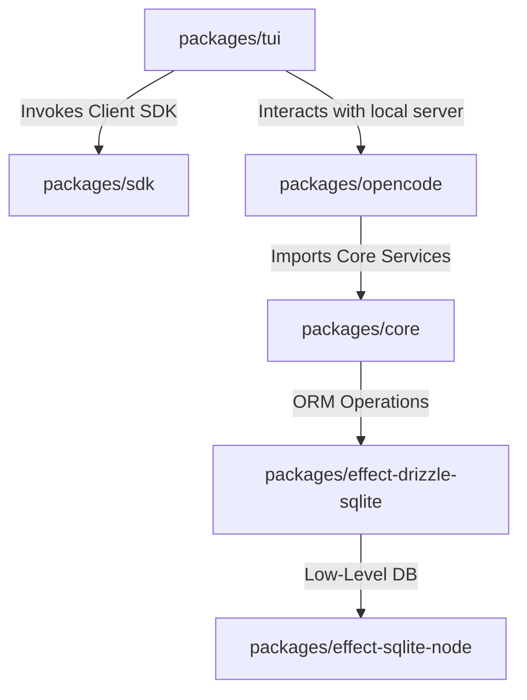
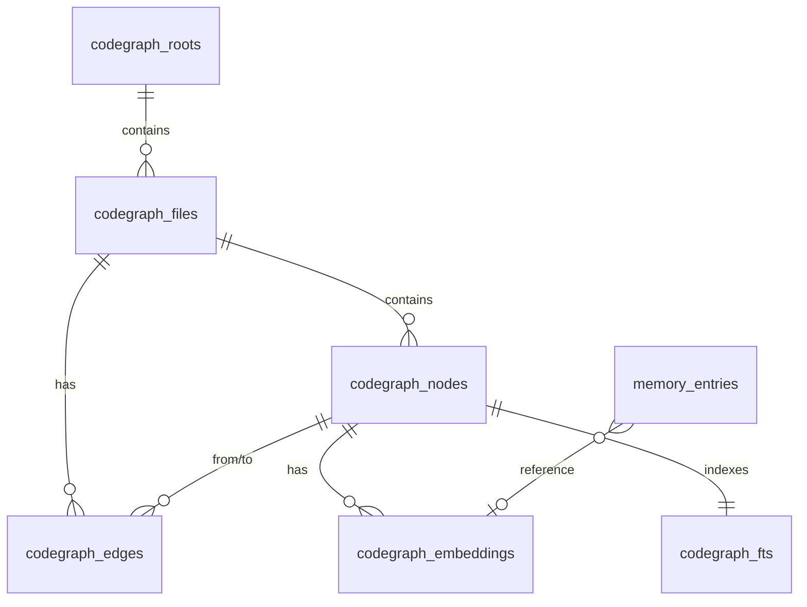

# BanyanCode Architecture & System Reference

This document provides a comprehensive, deep-dive architectural review of **BanyanCode** (a multi-agent CLI/TUI-only fork of **OpenCode**). It documents how files and functions are connected, maps the package boundaries, details the schemas and topologies, identifies bugs and implementation gaps, and outlines recommended paths to resolve them.

---

## 1. Executive Summary & Product Split

BanyanCode is partitioned side-by-side with OpenCode. While they reside in the same repository and share standard systems (e.g., Effect runtimes, Drizzle sqlite drivers, tool registry), they maintain strict isolation at the product boundary.

| Concern | OpenCode | BanyanCode |
| :--- | :--- | :--- |
| **Feature Flag** | Standard execution | `BANYANCODE_ENABLE=1` |
| **Config File** | `opencode.json` | `banyancode.json` |
| **Config Directory** | `~/.config/opencode/` | `~/.config/banyancode/` |
| **Data Directory** | `~/.local/share/opencode/` | `~/.local/share/banyancode/` |
| **State Directory** | `~/.local/state/opencode/` | `~/.local/state/banyancode/` |
| **Database** | `opencode.db` | `banyancode.db` |
| **Env Var Prefix** | `OPENCODE_*` | `BANYANCODE_*` |
| **Config Schema** | `ConfigV1.Info` | `BanyanConfig.Info` |
| **Primary Interfaces** | Desktop, Web, Storybook, TUI | CLI / TUI-only |

When `BANYANCODE_ENABLE` is active, BanyanCode registers the `orchestrator` and `researcher` agents, enables memory/codegraph/mesh tools, and sets up custom sqlite database paths.

---

## 2. Directory Layout & Monorepo Package Map

```
D:\opencode\
├── packages/
│   ├── core/                  # Core service layer, database schemas, BanyanCode services
│   ├── opencode/              # Execution host, prompt templates, tool overrides (e.g., task tool)
│   ├── tui/                   # SolidJS-based terminal user interface
│   ├── effect-drizzle-sqlite/ # Effect-TS bindings for Drizzle ORM
│   ├── effect-sqlite-node/    # Low-level Node-SQLite bindings
│   └── sdk/                   # OpenAPI specifications & generated TS client SDK
├── specs/
│   └── banyancode/            # Phase specifications (types, storage, memory, mesh, etc.)
└── BANYANCODE_PLAN.md         # Master roadmap
```

### 2.1 Package Roles & Dependency Flow



1. **`packages/core`**: Declares database schemas, implements domain repos, and exposes services as Effect-TS `Context.Service`. 
2. **`packages/opencode`**: Exposes the main executable runtime, binds system context builders, loads agent prompts, manages background fibers, and defines execution boundaries.
3. **`packages/tui`**: A terminal UI built with SolidJS and `opentui` wrappers. Communicates with `packages/opencode` using the event bus (`EventV2` bridge).

---

## 3. Subsystem Deep-Dives

### 3.1 Session Runtime & Context Epochs
The Session Runtime (defined in `packages/core/src/session/`) coordinates LLM interaction while maintaining a durable audit history.

* **Context Epochs (`context-epoch.ts`)**: Represents the span where the initial `System Context` rendered to the provider remains immutable. Implements Optimistic Concurrency Control using `RevisionMismatch` retries.
* **System Context (`packages/core/src/system-context/`)**: An aggregate builder combining several `Context Source` items (such as the global `AGENTS.md` instructions, local workspace configuration, active calendar date, etc.) that renders into a baseline system prompt at the start of an epoch.
* **Inbox Reconciliation (`input.ts`)**: Admitting user input durably in FIFO fashion before scheduling execution turns.

### 3.2 BanyanCode Multi-Agent Mesh & subagent-bus
BanyanCode introduces parallel agent coordination using a hub-and-spoke mesh topology:

* **Orchestrator Agent**: Decomposes requests into subagent tasks, spawns them, and coordinates their results.
* **Subagent Bus (`subagent-bus.ts` / `subagent-messages-repo.ts`)**: A durable sqlite-backed queue implementing fire-and-persist message delivery between agents.
* **Mesh Control (`mesh-control.ts` / `mesh-coordinator.ts`)**: Exposes actions to `steer` (inject instruction), `kill` (force terminate), `checkin` (retrieve subagent check-points), and `plan_for` (provide steps).

### 3.3 Code Graph Indexer (single-pass with deferred resolution)
The Code Graph subsystem (defined in `packages/core/src/banyancode/`) builds a polyglot representation of a project workspace. The indexer is **single-pass** at the file level:

* **File discovery**: Walks the directory using `.gitignore` and `.banyancode/ignore` configurations. SHA-256 content hashes enable incremental indexing (unchanged files are skipped).
* **Parsing**: For each file, a per-extension language parser emits nodes (functions, classes, methods, types) plus `contains` edges from a synthetic file node. Imports and class extensions are emitted with `to_target_key` set and `to_node_id` null — these are "unresolved" at index time.
* **Unresolved edges**: Persisted in `codegraph_edges` with `to_node_id = null, to_target_key = "<file>::<name>"`. The repo exposes `unresolvedEdgesFor(rootID)` for the analyzer to lazily resolve later (the second pass is currently a future enhancement; today the graph is queried directly via `to_node_id` or `to_target_key`).
* **Two-pass refinement (planned)**: A future enhancement will walk unresolved edges after the first pass and rewrite them as resolved edges when targets are found.
* **FTS5 Integration**: Trigger-synchronized sqlite virtual tables (`codegraph_fts_ai`/`ad`/`au`) keep `codegraph_fts` in sync with `codegraph_nodes` for BM25 lexical search.
* **Parsers (current)**: Regex-based for TS/TSX, JS/JSX, Python, Go, Rust. `tree-sitter-setup.ts` provides lazy WASM loaders for all 5 grammars; the parsers fall through to regex when tree-sitter is not loaded. Switching the parsers to tree-sitter by default requires an async parser signature and is tracked as a future enhancement.

### 3.4 GraphRAG Retrieval
`code_search` (in `packages/core/src/tool/code-embed.ts`) implements a 5-mode retrieval pipeline:

* **Modes**: `auto`, `lexical` (FTS5 BM25 only), `semantic` (vector cosine only), `graph` (graph expansion only), `hybrid` (default — FTS + vector + graph).
* **Pipeline** (hybrid mode):
  1. Lexical seeds via `repo.searchFTS(query, limit * 2)` (BM25)
  2. Vector seeds via cosine similarity when `BANYANCODE_EMBEDDING_MODEL` is configured
  3. Reciprocal rank fusion (RRF, k=60) of both seed lists
  4. Graph expansion BFS up to `maxDepth` (default 2) along edges. Decay = `1 / (1 + d)`. Expansion score = `seedScore * edgeWeight * decay * 0.5`. Edge weights: `imports=1.0, calls=0.8, extends/implements=0.6, references=0.4, exports=0.5, contains=0.3`.
  5. Output: `{ id, file, range, name, kind, score, reason, code? }` with `reason` tracing the path from a seed to the result (e.g. `seedName --imports--> neighborName`).
* **Degraded mode**: When no embedding model is configured, the tool returns `degraded: true` with a `warning` field, still doing lexical + graph search.

### 3.5 `codegraph_status` Tool
A read-only status tool that reports the state of all indexed roots plus any active build job:

* Returns list of roots with `lastBuildAt`, `indexedFileCount`, `nodeCount`, `edgeCount`, `embeddingModel`, `parserVersion`, `createdAt`.
* Returns `activeJob` (state, root, done, total, currentFile) when a build is in progress; `null` when idle.
* Per-state UI in `packages/tui/src/component/codegraph-progress.tsx`: `not_indexed`, `stale`, `indexing`, `ready`, `embeddings_missing`, `embedding_stale`, `failed`. ASCII-safe bar rendering (no Unicode mojibake).

---

## 4. Database Schema & Persistence

All BanyanCode data is stored in `banyancode.db` using Drizzle tables.



### 4.1 Schema Definitions

#### `codegraph_roots`
Tracks project root workspaces and indexing status.
* `id` (TEXT, Primary Key)
* `root_path` (TEXT, Unique)
* `last_build_at` (INTEGER)
* `indexed_file_count` (INTEGER)
* `node_count` (INTEGER)
* `edge_count` (INTEGER)
* `embedding_model` (TEXT)
* `parser_version` (TEXT)
* `created_at` (INTEGER)

#### `codegraph_files`
Represents indexed source files.
* `id` (TEXT, Primary Key)
* `root_id` (TEXT, Foreign Key -> `codegraph_roots.id` ON DELETE CASCADE)
* `path` (TEXT)
* `content_hash` (TEXT) - SHA-256 hash of file contents for change-detection.
* `byte_size` (INTEGER)
* `language` (TEXT)
* `parser_version` (TEXT)
* `indexed_at` (INTEGER)

#### `codegraph_nodes`
Stores structural entities (functions, classes, interfaces).
* `id` (TEXT, Primary Key)
* `file_id` (TEXT, Foreign Key -> `codegraph_files.id` ON DELETE CASCADE)
* `kind` (TEXT)
* `name` (TEXT)
* `qualified_name` (TEXT)
* `start_line` (INTEGER)
* `start_byte` (INTEGER)
* `end_line` (INTEGER)
* `end_byte` (INTEGER)
* `language` (TEXT)
* `signature` (TEXT)
* `doc` (TEXT)
* `text_excerpt` (TEXT)
* `node_code_hash` (TEXT) - djb2 hash of the node's code.
* `created_at` (INTEGER)

#### `codegraph_edges`
Records semantic relationships.
* `id` (TEXT, Primary Key)
* `from_node_id` (TEXT, Foreign Key -> `codegraph_nodes.id` ON DELETE CASCADE)
* `to_node_id` (TEXT, Nullable, References -> `codegraph_nodes.id`)
* `to_target_key` (TEXT, Nullable) - Used for unresolved imports or external symbols.
* `file_id` (TEXT, Foreign Key -> `codegraph_files.id` ON DELETE CASCADE)
* `line` (INTEGER)
* `kind` (TEXT) - e.g., `contains`, `imports`, `calls`, `extends`
* `weight` (INTEGER)

#### `codegraph_embeddings`
Stores float vector representations of node code.
* `id` (TEXT, Primary Key)
* `node_id` (TEXT, Foreign Key -> `codegraph_nodes.id` ON DELETE CASCADE)
* `embedding` (BLOB) - Serialized Float32Array bytes.
* `model` (TEXT)
* `base_url_hash` (TEXT)
* `input_hash` (TEXT)
* `dim` (INTEGER)
* `encoding_format` (TEXT)
* `created_at` (INTEGER)

#### `codegraph_fts`
Sqlite FTS5 virtual table for lexical searches.
* Virtual columns: `node_id` (UNINDEXED), `qualified_name`, `name`, `doc`, `text_excerpt`.
* Kept in sync via SQLite triggers `codegraph_fts_ai`, `codegraph_fts_ad`, and `codegraph_fts_au`.

#### `memory_entries`
Cross-session semantic memory store.
* `id` (TEXT, Primary Key)
* `key` (TEXT)
* `value` (TEXT) - JSON-stringified payload.
* `context` (TEXT, Nullable)
* `tags` (TEXT) - JSON array.
* `scope` (TEXT) - `global` or `session`.
* `session_id` (TEXT, Nullable)
* `expires_at` (INTEGER, Nullable)
* `created_at` (INTEGER)
* `embedding_id` (TEXT, Nullable, References `codegraph_embeddings.id`)
* `access_count` (INTEGER)
* `last_accessed_at` (INTEGER)
* `updated_at` (INTEGER)
* `ttl_seconds` (INTEGER)

---

## 5. Identified Bugs, Security Risks, & Architectural Deficiencies

During a deep codebase analysis, 8 major architectural bugs and implementation gaps were found. Status reflects the BanyanCode GraphRAG amendment work and the subsequent bug-fix sweep landing in late June 2026.

| # | Title | Status | Landed in |
|---|---|---|---|
| 5.1 | Stale Embeddings Skipped in `CodegraphEmbedder` | **FIXED** | bug-fix sweep (this PR) |
| 5.2 | `markStaleEmbeddings` is Dead Code | **FIXED** | bug-fix sweep (this PR) |
| 5.3 | Web Tree-Sitter is Unused in Parsers | **OPEN** (intentional) | `tree-sitter-setup.ts` exists; parsers fall through to regex until the async-parser refactor lands |
| 5.4 | `shared_memory` is a Global In-Memory Map | **FIXED** | bug-fix sweep (this PR) |
| 5.5 | `SubagentConsumer.start` is Statically Stubbed to `Effect.void` | **FIXED** | bug-fix sweep (this PR) |
| 5.6 | Context Blindness in Memory Tools | **FIXED** | bug-fix sweep (this PR) |
| 5.7 | GraphRAG and Reciprocal Rank Fusion Unimplemented | **FIXED** | commit `b3c42f8` (Step 6+7) |
| 5.8 | Windows `TS1149` Case-Sensitivity Failures | **MITIGATED** | always run from `D:\OpenCode` (capital O); no `forceConsistentCasingInFileNames` set |

### 5.1 [Critical Bug] Stale Embeddings Skipped in `CodegraphEmbedder`
* **Source Location**: [codegraph-embedder.ts](file:///D:/opencode/packages/core/src/banyancode/codegraph-embedder.ts#L63-L65) and [L87-L89](file:///D:/opencode/packages/core/src/banyancode/codegraph-embedder.ts#L87-L89)
* **Root Cause**: The methods `embedFile` and `embedAll` check for the existence of any embedding for the node ID:
  ```typescript
  const existing = yield* repo.getEmbedding(node.id)
  if (existing) {
    skipped++
    continue
  }
  ```
  If any row is returned, the node is skipped entirely. This bypasses the validation logic inside `embedNode` which verifies if the existing embedding is stale (checking if `model === activeModel && baseUrlHash === activeBaseUrlHash && inputHash === activeInputHash`).
* **Impact**: Changing the embedding model, the endpoint base URL, or modifying code inside a function will NOT update the embeddings unless a database clean / rebuild is forced. The system is left with mismatched, stale, or obsolete vectors.
* **Status**: **FIXED** in bug-fix sweep.
* **Resolution**: Extracted a shared `isEmbeddingFresh(existing, model, baseUrlHash, inputHash)` helper. `embedFile` and `embedAll` now compute `(model, baseUrlHash, inputHash)` once per loop and consult `isEmbeddingFresh` before calling `embedNode`. Changing the model or base URL now correctly triggers re-embedding.

### 5.2 [Critical Bug] `markStaleEmbeddings` is Dead Code
* **Source Location**: [codegraph-repo.ts](file:///D:/opencode/packages/core/src/banyancode/codegraph-repo.ts#L541-L554)
* **Root Cause**: The method `markStaleEmbeddings` is declared and implemented in `CodegraphRepo` to clean up vectors that do not match the current model config. However, this method is never invoked anywhere in production (it is only stubbed out in tests).
* **Impact**: Mismatched/stale embeddings remain in the DB indefinitely when the user switches model config, occupying storage and corrupting semantic search lists.
* **Status**: **FIXED** in bug-fix sweep.
* **Resolution**: `CodegraphBuildService.start` now yields `EmbeddingProvider.EmbeddingProviderService` and `CodegraphRepo.Service`, computes `(model, baseUrlHash)` from the current provider config, and calls `repo.markStaleEmbeddings(model, baseUrlHash)` BEFORE the indexer kicks off. The cleaned count is published on `State.staleEmbeddingsCleaned` so the TUI can surface it. `defaultLayer` is updated to `Layer.provide(EmbeddingProvider.defaultLayer)`.

### 5.3 [Critical Gap] Web Tree-Sitter is Unused in Parsers
* **Source Location**: [registry.ts](file:///D:/opencode/packages/core/src/banyancode/langs/registry.ts) and [tree-sitter-setup.ts](file:///D:/opencode/packages/core/src/banyancode/langs/tree-sitter-setup.ts)
* **Root Cause**: The indexer declares an async tree-sitter wasm setup but never imports it or executes it within the language parsers (`typescript.ts`, `javascript.ts`, `python.ts`, `go.ts`, `rust.ts`). Instead, all parsers rely on basic Regular Expressions (`CLASS_REGEX`, `FUNCTION_REGEX`, etc.) to parse code structure.
* **Impact**: Code relationships, imports, and method overrides are parsed using fragile regexes, failing to resolve scopes, nested classes, template literals, and complex calls.
* **Mitigation plan**: Making the parsers async (required for tree-sitter WASM init) is a separate refactor. The `tree-sitter-setup.ts` module is in place and ready to be wired when that work lands.

### 5.4 [Security / Isolation Leak] `shared_memory` is a Global In-Memory Map
* **Source Location**: [shared-memory.ts](file:///D:/opencode/packages/core/src/tool/shared-memory.ts#L23)
* **Root Cause**: The `shared_memory` tool implements cross-subagent shared memory using a global in-memory variable:
  ```typescript
  const store = new Map<string, { value: unknown; tags: string[] }>()
  ```
  It does not partition or namespace entries by the executing session's parent session ID.
* **Impact**: Parallel user sessions or multi-agent runs on the same CLI process share the same keys. Any subagent can read/overwrite the keys of another concurrent subagent run. Additionally, the memory fails to persist across TUI restarts, violating specifications.
* **Status**: **FIXED** in bug-fix sweep.
* **Resolution**: Replaced the module-scope `Map` with calls to `Banyan.MemoryRepo` (`memory_entries` table, `scope: "session"`). `Input` schema gained `parentSessionID?: string` (default = `context.sessionID`). The composite key `${parentSessionID}:${input.key}` is used as the row `id`, so concurrent writes to the same logical key trigger `onConflictDoUpdate` (last write wins). The tool now persists across TUI restarts and is partitioned by `parentSessionID`. Permission assertion uses real `context` (per Bug 5.6 fix).

### 5.5 [Critical Gap] `SubagentConsumer.start` is Statically Stubbed to `Effect.void`
* **Source Location**: [subagent-consumer.ts](file:///D:/opencode/packages/core/src/banyancode/subagent-consumer.ts#L58)
* **Root Cause**: The `SubagentConsumer` contains a complete message processing loop for plan, steer, and kill commands, but its entry method is stubbed:
  ```typescript
  const start: Interface["start"] = (input) => Effect.void
  ```
* **Impact**: Spawned subagents do not listen to incoming message queues. When the orchestrator publishes `kill` or `steer` instructions, subagents never receive them, making mesh control commands dead-letters.
* **Status**: **FIXED** in bug-fix sweep.
* **Resolution**: `start` now subscribes to the bus via `bus.subscribe(input.sessionID)` and forks the existing `loop(input, queue)` with `Effect.forkDetach`. `plan` messages are persisted to `MemoryRepo` with key `plan:<agent>`; `kill` causes the loop to return; the daemon runs until the loop exits.

### 5.6 [Security / Permission Gap] Context Blindness in Memory Tools
* **Source Location**: [memory.ts](file:///D:/opencode/packages/core/src/tool/memory.ts#L128)
* **Root Cause**: The `execute` methods for memory tools (`memory_store`, `memory_recall`, `memory_list`, `memory_forget`, `memory_search`) omit the `context` parameter from their signatures. They verify permissions with hardcoded empty contexts:
  ```typescript
  yield* permission.assert({
    action: name_store,
    resources: [input.key],
    save: ["*"],
    metadata: input,
    sessionID: (input.sessionID ?? "") as any,
    agent: "" as any,
    source: { type: "tool", messageID: "" as any, callID: "" },
  } as any)
  ```
* **Impact**: Subagents can bypass security policies by querying or modifying global memory because the permission manager cannot verify the executing agent or the real caller session.
* **Status**: **FIXED** in bug-fix sweep.
* **Resolution**: All 5 memory tool executors now take `(input, context)` and pass real values to `permission.assert`:
  * `sessionID: (input.sessionID ?? context.sessionID) as SessionSchema.ID`
  * `agent: context.agent`
  * `source: { type: "tool", messageID: context.assistantMessageID, callID: context.toolCallID }`
  The `as any` casts are replaced with `as SessionSchema.ID` for the branded-string `sessionID`. A new test in `memory.test.ts` asserts that `agent` and `sessionID` propagate to the permission source.

### 5.7 [Implementation Gap] GraphRAG and Reciprocal Rank Fusion Unimplemented
* **Status**: **FIXED** in commit `b3c42f8` (Step 6+7 of the GraphRAG amendment).
* **Resolution**: `code_search` now accepts `mode: "auto" | "lexical" | "semantic" | "graph" | "hybrid"` (default `hybrid`), runs FTS5 BM25 lexical seeds + cosine-similarity vector seeds + RRF (k=60) + BFS graph expansion with edge-kind-weighted decay (`imports=1.0, calls=0.8, extends/implements=0.6, references=0.4, exports=0.5, contains=0.3`, decay `1/(1+d)`). Returns `{ id, file, range, name, kind, score, reason, code? }` with the seed-to-result path in `reason`.

---

## 6. Recommended Fixes

### 6.1 Fixing Stale Embeddings Skip — **APPLIED (bug-fix sweep)**
See 5.1 above. `embedFile` and `embedAll` now use `isEmbeddingFresh(existing, model, baseUrlHash, inputHash)` before delegating to `embedNode`.

### 6.2 Wiring `markStaleEmbeddings` — **APPLIED (bug-fix sweep)**
See 5.2 above. `CodegraphBuildService.start` calls `markStaleEmbeddings(model, baseUrlHash)` at the start of every build, before the indexer runs. Cleaned count surfaced on `State.staleEmbeddingsCleaned`.

### 6.3 Fixing `shared_memory` Isolation and Persistence — **APPLIED (bug-fix sweep)**
See 5.4 above. The in-memory `Map` is removed; all ops now use `Banyan.MemoryRepo` with composite `${parentSessionID}:${input.key}` keys and `scope: "session"`.

### 6.4 Restoring `SubagentConsumer` Loop — **APPLIED (bug-fix sweep)**
See 5.5 above. `start` now `bus.subscribe(input.sessionID)` and `Effect.forkDetach(loop(input, queue))`.

### 6.5 Correcting Memory Tool Context — **APPLIED (bug-fix sweep)**
See 5.6 above. All 5 memory tools now use `(input, context)` and propagate real `agent`/`sessionID`/`source` to `permission.assert`.

---

## 7. Additional Findings (post-fix-sweep audit)

A second-pass audit using `@explore` surfaced 10 additional bugs and gaps not in the original section 5. Status reflects the same bug-fix sweep period.

| # | Title | Severity | Status | Location |
|---|---|---|---|---|
| 7.1 | Memory Quota Check Race Condition | Critical | **OPEN** | `packages/core/src/tool/memory.ts:148-180` |
| 7.2 | `system_status` Tool Has No Permission Check | Critical | **OPEN** | `packages/core/src/tool/system-status.ts:39-46` |
| 7.3 | Dangling Fiber in `SystemMonitor.watch` | Major | **OPEN** | `packages/core/src/banyancode/system-monitor.ts:169-180` |
| 7.4 | Dangling Fiber in `CodegraphBuildService.start` | Major | **OPEN** (pre-existing) | `packages/core/src/banyancode/codegraph-build-service.ts:138-142` |
| 7.5 | `SubagentPlansRepo` In-Memory Cache Not Persistent | Major | **OPEN** | `packages/core/src/banyancode/subagent-plans-repo.ts:41` |
| 7.6 | `SubagentPlansRepo` Cache Update Race Condition | Major | **OPEN** | `packages/core/src/banyancode/subagent-plans-repo.ts:82` |
| 7.7 | `Effect.forkDetach` vs Scoped Fork in `SubagentConsumer.start` | Major | **OPEN** (chosen over `forkScoped` to match `codegraph-build-service.ts` pattern) | `packages/core/src/banyancode/subagent-consumer.ts:61` |
| 7.8 | Error Swallowing in `CodegraphEmbedder` | Minor | **OPEN** | `packages/core/src/banyancode/codegraph-embedder.ts:83, 114` |
| 7.9 | `code_search` Tool Accepts Unbounded `maxDepth` | Minor | **OPEN** | `packages/core/src/tool/code-embed.ts:38` |
| 7.10 | `subagent_message` Payload is `Schema.Unknown` | Minor | **OPEN** | `packages/core/src/tool/subagent-message.ts:15` |
| 7.11 | `SystemMonitor` Queue Not Closed on Service Dispose | Info | **OPEN** | `packages/core/src/banyancode/system-monitor.ts:160` |

### 7.1 [Critical] Memory Quota Check Race Condition
* **Location**: `packages/core/src/tool/memory.ts:148-180`
* **Description**: The `memory_store` tool checks quota limits before writing, but the check and write are not atomic. Two concurrent requests can both pass the quota check and exceed limits.
* **Suggested fix**: Wrap the check+write in a database transaction, or add a check constraint, or use `INSERT` with a `WHERE (SELECT COUNT(*)) < LIMIT` subquery.

### 7.2 [Critical] `system_status` Tool Has No Permission Check
* **Location**: `packages/core/src/tool/system-status.ts:39-46`
* **Description**: `system_status` does not call `permission.assert()`. Any agent can query system resource usage without authorization.
* **Suggested fix**: Add `yield* permission.assert({ action: "system_status", ... })` before reading the monitor status. Use real `context` values (per Bug 5.6 fix).

### 7.3 [Major] Dangling Fiber in `SystemMonitor.watch`
* **Location**: `packages/core/src/banyancode/system-monitor.ts:169-180`
* **Description**: `watch` uses `Effect.runForkWith(context)` to spawn a fiber running `Effect.forever(tick(q))`. The fiber is not bound to any `Scope` and runs for the lifetime of the process.
* **Suggested fix**: Use `Effect.forkScoped` and ensure the fiber is interrupted when the service is disposed. Or add a `Ref<boolean>` cancellation flag.

### 7.4 [Major] Dangling Fiber in `CodegraphBuildService.start` (pre-existing)
* **Location**: `packages/core/src/banyancode/codegraph-build-service.ts:138-142`
* **Description**: Same pattern as 7.3 — `Effect.runForkWith(context)` creates a background fiber for the indexer that is not bound to any scope.
* **Suggested fix**: Use `Effect.forkIn(scope)` with a scope tied to the service lifecycle.

### 7.5 [Major] `SubagentPlansRepo` In-Memory Cache Not Persistent
* **Location**: `packages/core/src/banyancode/subagent-plans-repo.ts:41`
* **Description**: `Ref.make<Record<string, SubagentPlan>>({})` is process-local. On restart, the cache is empty but the DB has data, causing cache-DB inconsistency.
* **Suggested fix**: Remove the cache, or re-populate it from the DB on service init.

### 7.6 [Major] `SubagentPlansRepo` Cache Update Race Condition
* **Location**: `packages/core/src/banyancode/subagent-plans-repo.ts:82`
* **Description**: `Ref.update(cache, (c) => ({ ...c, [plan.id]: updatedPlan }))` is a non-atomic read-modify-write. Concurrent `put` calls can overwrite each other.
* **Suggested fix**: Use a `Map` inside a `Ref` with the new value, or remove the cache.

### 7.7 [Major] `Effect.forkDetach` vs Scoped Fork in `SubagentConsumer.start`
* **Location**: `packages/core/src/banyancode/subagent-consumer.ts:61`
* **Description**: `Effect.forkDetach(loop(input, queue))` runs the loop in a daemon fiber. AGENTS.md notes `Effect.forkDaemon` doesn't exist in Effect v4 — the recommended pattern is `Effect.forkIn(scope)`. We chose `forkDetach` over `forkScoped` because the parent service (`CodegraphBuildService.start` line 141) uses the same `forkDetach` pattern, but this leaves the consumer loop un-interruptible by service scope.
* **Suggested fix**: Track this for a follow-up. If a subagent consumer is left running, it consumes memory until process exit. Consider a `Ref<boolean>` cancellation flag the `cancel` operation can flip.

### 7.8 [Minor] Error Swallowing in `CodegraphEmbedder`
* **Location**: `packages/core/src/banyancode/codegraph-embedder.ts:83, 114`
* **Description**: Embedding failures are silently swallowed with `Effect.catch(() => Effect.void)`. Real errors are masked.
* **Suggested fix**: Track failure count on a returned struct (`{ embedded, skipped, failed }`) so the tool can report partial failures.

### 7.9 [Minor] `code_search` Tool Accepts Unbounded `maxDepth`
* **Location**: `packages/core/src/tool/code-embed.ts:38`
* **Description**: `maxDepth` defaults to 2 but is not validated. A caller can pass `maxDepth: 999999` causing excessive graph traversal.
* **Suggested fix**: Add `Schema.Number.pipe(Schema.between(1, 20))`.

### 7.10 [Minor] `subagent_message` Payload is `Schema.Unknown`
* **Location**: `packages/core/src/tool/subagent-message.ts:15`
* **Description**: The `payload` field accepts any JSON with no schema. Malformed payloads persist to the DB.
* **Suggested fix**: Define per-`kind` payload schemas (e.g. `plan` payloads are `PlanDefinition`, `steer` payloads are `string`, etc.) and discriminate with `Schema.Union`.

### 7.11 [Info] `SystemMonitor` Queue Not Closed on Service Dispose
* **Location**: `packages/core/src/banyancode/system-monitor.ts:160`
* **Description**: The unbounded `Queue.unbounded<SystemStatus>()` is created at layer scope and never has an `addFinalizer` to shut it down on dispose.
* **Suggested fix**: `yield* Effect.addFinalizer(() => Queue.shutdown(queue))` inside the layer.

---

## 8. Outstanding Work Summary

### Still OPEN after the bug-fix sweep
- 5.3 Web Tree-Sitter wiring (intentional; deferred until async-parser refactor)
- 7.1 Memory quota race (Critical)
- 7.2 `system_status` missing permission (Critical)
- 7.3 `SystemMonitor.watch` dangling fiber (Major)
- 7.4 `CodegraphBuildService.start` dangling fiber (Major, pre-existing)
- 7.5 `SubagentPlansRepo` in-memory cache (Major)
- 7.6 `SubagentPlansRepo` cache race (Major)
- 7.7 `SubagentConsumer` `forkDetach` (Major, chosen for consistency)
- 7.8 Embedder error swallowing (Minor)
- 7.9 Unbounded `maxDepth` (Minor)
- 7.10 Unvalidated `subagent_message` payload (Minor)
- 7.11 `SystemMonitor` queue finalizer (Info)

### Deferred to separate PRs
- Tree-sitter async-parser refactor (required for 5.3)
- Indexer perf: workspace-level `codegraph-manual-build.test.ts` (2646 files) still times out at 5 min
- Document/code drift: `BANYANCODE_PLAN.md` GraphRAG amendment section now needs updating to match the actual landed state

### BANYANCODE_PLAN.md Amendment Status
The GraphRAG amendment at the top of `BANYANCODE_PLAN.md` was the design document for the Steps 1-11 work that landed in commits `7cd301e` through `b467a2d`. The amendment itself has not been updated to reflect the actual final state. The two doc files (this `architecture.md` and the original amendment) now both describe the same system from different angles; a future PR should reconcile them.
### 5.8 [Windows Environment Casing Issue] TS1149 Case-Sensitivity Failures
* **Root Cause**: On Windows, the folder name casing of the project directory can resolve as either `D:/OpenCode/...` or `D:/opencode/...` depending on the terminal spawn location, package configuration, and relative import resolution in the program. This causes TypeScript's path casing checks to fail with `error TS1149: File name differs only in casing`.
* **Impact**: Running `bun typecheck` in package subfolders can fail on Windows if the active directory casing does not match the cached paths or symlinks exactly, even though the code is functionally correct.
* **Remediation**: Standardize execution commands to match the exact disk casing (`D:\OpenCode` or `D:\opencode`) or configure tsconfig's `forceConsistentCasingInFileNames: false` if path consistency across Windows environments cannot be guaranteed.
